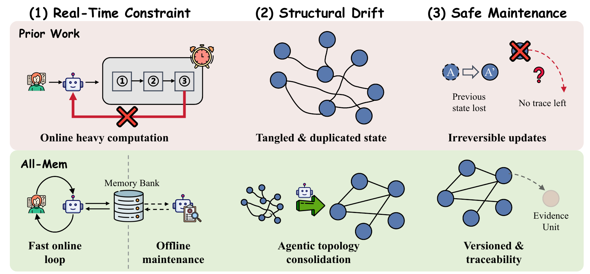
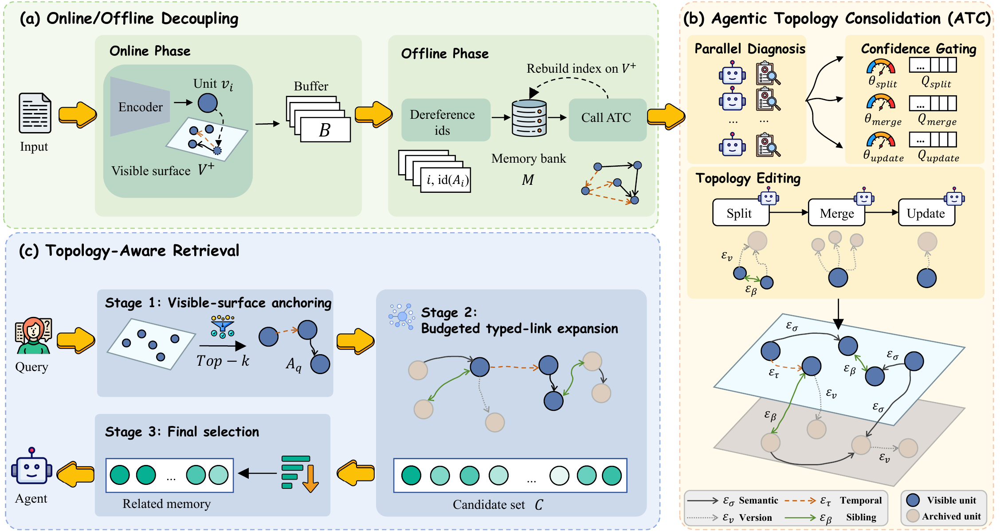

# All-Mem: Agentic Lifelong Memory via Dynamic Topology Evolution

[](https://arxiv.org/abs/2603.19595)
[](https://arxiv.org/pdf/2603.19595)
[](#environment-setup)
[](#evaluation)
[](#evaluation)
[](LICENSE)

Code for **["All-Mem: Agentic Lifelong Memory via Dynamic Topology
Evolution"](https://arxiv.org/abs/2603.19595)**.

All-Mem is an agentic lifelong memory framework for long-running LLM agents.
It keeps a bounded visible memory surface for fast retrieval, periodically
repairs memory topology with offline agentic consolidation, and preserves
recoverability to immutable raw evidence.


---

## Overview

<p align="center">
  
</p>

**All-Mem treats lifelong agent memory as a topology maintenance and recovery
problem.**

- **Online/offline decoupling**: new interactions are written online with
  lightweight descriptors and links, while expensive topology repair is deferred
  to offline consolidation.
- **Agentic Topology Consolidation (ATC)**: an LLM diagnoser proposes
  confidence-scored Split, Merge, and Update operations for local graph
  neighborhoods.
- **Non-destructive editing**: raw evidence is not overwritten; superseded or
  redundant units are archived with typed recovery links.
- **Topology-aware retrieval**: queries first retrieve visible anchors, then
  expand through typed links to recover archived evidence under a fixed budget.

<p align="center">
  
</p>

## Main Results

The paper reports experiments with GPT-4o-mini at temperature `0`,
All-MiniLM-L6-v2 embeddings, matched retrieval/context budgets, and offline
consolidation every 3 sessions. The reported ATC threshold is `theta = 0.9`;
the reported semantic out-degree cap is `d_sigma = 8`.

| Dataset | 4o-J | F1 | BLEU-1 | ROUGE-L | R@5 | N@5 |
| --- | ---: | ---: | ---: | ---: | ---: | ---: |
| LoCoMo | 54.63 | 52.18 | 46.31 | 52.01 | 46.63 | 41.02 |
| LongMemEval-s | 60.20 | 45.19 | 36.42 | 45.94 | 94.68 | 93.27 |

Retrieval metrics are not directly comparable across datasets: LoCoMo uses
turn-level evidence matching, while LongMemEval-s uses session-level evidence
matching.

## Repository Structure

```text
all_mem_refactor/
  all_mem/
    core.py                 # AllMemSystem, AllMemGraph, AllMemNode
    llm.py                  # LLMController and backend adapters
    data/                   # LoCoMo and LongMemEval-s loaders
    eval/                   # benchmark evaluation and metrics
    analysis/               # recoverability analysis
  figures/                  # README figures
  scripts/
    evaluate_locomo.py
    evaluate_longmemeval.py
    judge_results.py
    compute_recoverability.py
    download_longmemeval.py
    api_benchmark.py
  requirements.txt
  README.md
```

Generated benchmark outputs are written under `results/`; cached memory graphs
are written under `cache/`.

## Environment Setup

```bash
conda create -n all-mem python=3.10 -y
conda activate all-mem
python -m pip install -r requirements.txt
```

Run all commands below from the repository root. The package is importable
directly from this checkout.

For paper-level experiments, make sure these models are available locally or
downloadable from Hugging Face:

- `sentence-transformers/all-MiniLM-L6-v2`
- `cross-encoder/ms-marco-MiniLM-L-6-v2`

The implementation includes a deterministic hash-embedding fallback for
dependency-light smoke tests. Do not use that fallback for reported benchmark
numbers.

## API Configuration

All-Mem reads API credentials from environment variables or CLI arguments. Do
not commit API keys to the repository.

OpenAI-compatible backend:

```bash
export OPENAI_API_KEY=...
export OPENAI_API_BASE=https://api.openai.com/v1
```

OpenRouter or another OpenAI-compatible endpoint:

```bash
export OPENROUTER_API_KEY=...
export OPENROUTER_BASE_URL=https://openrouter.ai/api/v1
```

When using OpenRouter, pass a provider-qualified model name if needed, for
example `--model openai/gpt-4o-mini`. The backend also checks `ARK_API_KEY`.

SGLang:

```bash
--backend sglang --sglang-host http://localhost --sglang-port 30000
```

Ollama:

```bash
--backend ollama --model llama3.1
```

## Data Preparation

Place datasets wherever convenient and pass their paths with `--dataset`.

Recommended local layout:

```text
all_mem_refactor/
  data/
    locomo/locomo10.json
    longmemeval/longmemeval_s_cleaned.json
```

Download LongMemEval-s:

```bash
python scripts/download_longmemeval.py --local-dir data/longmemeval
```

LoCoMo is not downloaded by this repository. Place `locomo10.json` locally and
provide its path to `scripts/evaluate_locomo.py`.

## Evaluation

This repository provides evaluation entry points for:

- **LoCoMo**: long-horizon conversational QA with turn-level retrieval labels.
- **LongMemEval-s**: long-horizon user-agent memory QA with session-level
  retrieval labels.
- **LLM-as-Judge**: JSONL answer-quality judging for generated benchmark
  outputs.

### LoCoMo

<details>
<summary>Run a smoke test</summary>

```bash
python scripts/evaluate_locomo.py \
  --dataset data/locomo/locomo10.json \
  --backend openai \
  --model gpt-4o-mini \
  --ratio 0.1 \
  --output results/all_mem/locomo/smoke.json
```

</details>

<details>
<summary>Run full evaluation</summary>

```bash
python scripts/evaluate_locomo.py \
  --dataset data/locomo/locomo10.json \
  --backend openai \
  --model gpt-4o-mini \
  --retrieve-k 10 \
  --sleep-interval-sessions 3 \
  --output results/all_mem/locomo/results.json
```

Graph caches will be saved under a directory such as:

```text
cache/all_mem_locomo_openai_gpt-4o-mini/
```

</details>

### LongMemEval-s

<details>
<summary>Run a smoke test</summary>

```bash
python scripts/evaluate_longmemeval.py \
  --dataset data/longmemeval/longmemeval_s_cleaned.json \
  --backend openai \
  --model gpt-4o-mini \
  --ratio 0.01 \
  --workers 1 \
  --output results/all_mem/longmemeval/smoke.json
```

</details>

<details>
<summary>Run full evaluation</summary>

```bash
python scripts/evaluate_longmemeval.py \
  --dataset data/longmemeval/longmemeval_s_cleaned.json \
  --backend openai \
  --model gpt-4o-mini \
  --workers 4 \
  --retrieve-k 10 \
  --sleep-interval-sessions 3 \
  --output results/all_mem/longmemeval/results.json
```

The script writes both a JSON summary and a JSONL result file:

```text
results/all_mem/longmemeval/results.json
results/all_mem/longmemeval/results.jsonl
```

Graph caches will be saved under a directory such as:

```text
cache/all_mem_longmemeval_openai_gpt-4o-mini/
```

</details>

### LLM-as-Judge

<details>
<summary>Judge JSONL outputs</summary>

```bash
python scripts/judge_results.py \
  --input results/all_mem/longmemeval/results.jsonl \
  --output results/all_mem/longmemeval/results_judged.jsonl \
  --model gpt-4o-mini \
  --concurrency 10
```

The judge uses `OPENAI_API_BASE` or `OPENROUTER_BASE_URL` when configured, and
falls back to OpenRouter's API base.

</details>

## Recoverability Analysis

Recoverability measures whether archived memory units remain reachable from
active units through sibling/version links within a bounded number of graph
hops.

<details>
<summary>Analyze a cached All-Mem graph</summary>

```bash
python scripts/compute_recoverability.py \
  --cache cache/all_mem_longmemeval_openai_gpt-4o-mini/all_mem_graph_<question_id>.pkl \
  --out-json results/recoverability.json \
  --out-csv results/recoverability_nodes.csv \
  --max-hops 20
```

</details>

## Usage Example

```python
from all_mem import AllMemSystem, LLMController

llm = LLMController(
    backend="openai",
    model="gpt-4o-mini",
)
memory = AllMemSystem(llm_controller=llm)

memory.wake_process(
    "Alice said she moved her violin lesson to Friday.",
    timestamp="2026-06-09",
    source_id="session-1-turn-1",
)
memory.sleep_process()

context, source_ids, latency = memory.get_context_for_query(
    "When is Alice's violin lesson?",
    anchor_k=10,
    final_k=10,
)
answer = memory.retrieve_and_answer("When is Alice's violin lesson?")
```

Persist and reload a memory graph:

```python
memory.save_graph("cache/example/all_mem_graph.pkl")
memory.load_graph("cache/example/all_mem_graph.pkl")
```

## Citation

If you use this code or build on All-Mem, please cite the paper:

```bibtex
@misc{lv2026allmemagenticlifelongmemory,
      title={All-Mem: Agentic Lifelong Memory via Dynamic Topology Evolution}, 
      author={Can Lv and Heng Chang and Yuchen Guo and Shengyu Tao and Shiji Zhou},
      year={2026},
      eprint={2603.19595},
      archivePrefix={arXiv},
      primaryClass={cs.IR},
      url={https://arxiv.org/abs/2603.19595}, 
}
```

## License

This project is released under the MIT License. See [LICENSE](LICENSE) for
details.
